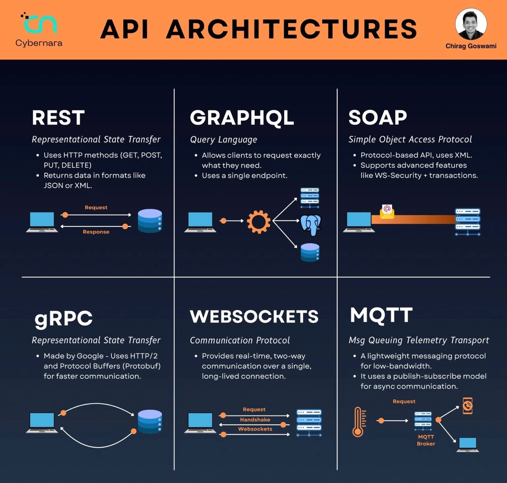

# 🚗 ESP32 IoT Car - MQTT Remote Control System

> A complete full-stack IoT project demonstrating embedded systems, mobile development, and backend integration


## ✨ Features

- 📱 **Android App** - Java with MVVM architecture, joystick control
- 🔌 **ESP32 Firmware** - Motor control, ultrasonic sensor, MQTT telemetry
- 🐹 **Go Backend** - Telemetry processing, fleet management
- 🐳 **Docker MQTT** - Mosquitto broker infrastructure
- 🎮 **Wokwi Simulation** - Test without hardware!

## 🏗️ Architecture

```
┌─────────────┐      MQTT       ┌──────────────┐      MQTT       ┌─────────────┐
│ Android App │ ──────────────► │   Mosquitto  │ ◄────────────── │   ESP32     │
│   (Java)    │   Commands      │    Broker    │   Telemetry     │  Firmware   │
└─────────────┘                 └──────────────┘                 └─────────────┘
                                       │
                                       │ Subscribe
                                       ▼
                                ┌──────────────┐
                                │  Go Backend  │
                                │  (Monitor)   │
                                └──────────────┘
```

## 🚀 Quick Start

### Prerequisites
- Docker Desktop
- Android Studio
- PlatformIO (VS Code extension)
- Go 1.25+

### 1. Start MQTT Broker
```bash
cd mqtt-broker
docker-compose up -d
```

### 2. Run Go Backend
```bash
cd go-backend
go run cmd/server/main.go
```

### 3. Run ESP32 (Wokwi Simulation)
```bash
cd firmware/iot-car-esp32
# Open in VS Code with PlatformIO + Wokwi extension
# or use wokwi.com with diagram.json
```

### 4. Run Android App
```bash
# Open android-app in Android Studio
# Build and run on emulator/device
```

## 📁 Project Structure

```
├── firmware/           # ESP32 PlatformIO project
├── android-app/        # Java Android app (MVVM)
├── go-backend/         # Go telemetry server
├── mqtt-broker/        # Docker Mosquitto setup
└── docs/               # Documentation & guides
```

## 📚 Documentation

| Guide | Description |
|-------|-------------|
| [Wokwi Simulation Guide](docs/guides/Wokwi_ESP32_Simulation_Guide.md) | Set up virtual ESP32 |
| [MQTT Complete Guide](docs/guides/MQTT_Complete_Guide.md) | Learn MQTT protocol |
| [Go Backend Guide](docs/guides/GO_BACKEND_GUIDE.md) | Understand the backend |

### Learning Materials
| Topic | Description |
|-------|-------------|
| [ESP32 Basics](docs/learning/ESP32_Basics.md) | GPIO, WiFi, PlatformIO |
| [MQTT Overview](docs/learning/MQTT_Protocol_Overview.md) | Protocol fundamentals |
| [Android MVVM](docs/learning/Android_MVVM_Architecture.md) | Architecture patterns |
| [Why Go for IoT](docs/learning/Why_Go_For_IoT.md) | Go in IoT projects |

## 🎓 Educational Value

This project teaches:
- **Embedded Systems** - ESP32 programming, sensors, GPIO
- **IoT Protocols** - MQTT pub/sub, QoS, topics
- **Mobile Development** - Android, Java, MVVM
- **Backend Development** - Go, concurrency, MQTT clients
- **DevOps** - Docker, containerization

## 📸 Demo

### 🎬 Video Demo
https://github.com/user-attachments/assets/iot-car-demo.mp4

[📹 Watch Full Demo Video](docs/media/videos/IoT%20Car.mp4)

---

### 🎮 Wokwi ESP32 Simulation

<p align="center">
  
</p>

*Virtual IoT Car with ESP32, HC-SR04 ultrasonic sensor, and L298N motor drivers running in Wokwi Simulator*

---

### 📱 Android Controller App

<p align="center">
  
</p>

*Android Studio layout designer showing the IoT Car Controller interface with joystick controls and MQTT status indicators*

<p align="center">
  
</p>

*MainViewModel implementation with MQTT connection management running on Pixel 7a emulator*

---

### 🔧 Full Stack Development Setup

<p align="center">
  
</p>

*VS Code with ESP32 firmware, Wokwi simulation, and Go backend telemetry running simultaneously*

<p align="center">
  
</p>

*Go backend source code alongside Wokwi virtual car simulation*

---

### 📚 MQTT Protocol Overview

<p align="center">
  
</p>

*Comparison of API architectures - This project uses MQTT for lightweight IoT messaging*


## 📄 License

MIT License - see [LICENSE](LICENSE) for details.

## 👤 Author

**DevJ** - [GitHub Profile](https://github.com/janak-dev2002) | 076-222-8848

---

⭐ Star this repo if you find it helpful!
