# System Architecture

> Complete architecture of the ESP32 IoT Car system

## High-Level Overview

```mermaid
graph TB
    subgraph "Mobile Layer"
        APP[📱 Android App<br/>Kotlin + MVVM]
    end
    
    subgraph "Message Broker"
        MQTT[🔄 Mosquitto<br/>MQTT Broker<br/>Docker]
    end
    
    subgraph "Backend Layer"
        GO[🐹 Go Server<br/>Telemetry Handler]
    end
    
    subgraph "Device Layer"
        ESP[🔌 ESP32<br/>PlatformIO]
        MOTOR[⚙️ Motors/LEDs]
        SENSOR[📡 Ultrasonic]
    end
    
    APP -->|"publish: command"| MQTT
    MQTT -->|"subscribe: command"| ESP
    ESP -->|"publish: telemetry"| MQTT
    MQTT -->|"subscribe: telemetry"| GO
    ESP --- MOTOR
    ESP --- SENSOR
```

## Communication Flow

### Command Flow (App → Car)

```mermaid
sequenceDiagram
    participant App as 📱 Android App
    participant Broker as 🔄 MQTT Broker
    participant ESP as 🔌 ESP32
    participant Motor as ⚙️ Motors
    
    App->>Broker: PUBLISH "iot-car/car-001/command" {"action": "forward"}
    Broker->>ESP: DELIVER message
    ESP->>Motor: digitalWrite(MOTOR_FWD, HIGH)
    ESP->>Broker: PUBLISH "iot-car/car-001/response" {"status": "ok"}
```

### Telemetry Flow (Car → Backend)

```mermaid
sequenceDiagram
    participant ESP as 🔌 ESP32
    participant Broker as 🔄 MQTT Broker
    participant Go as 🐹 Go Backend
    
    loop Every 500ms
        ESP->>Broker: PUBLISH "iot-car/car-001/telemetry"<br/>{"distance": 45, "battery": 85}
        Broker->>Go: DELIVER message
        Go->>Go: Parse JSON, log data
    end
```

## MQTT Topic Structure

| Topic | Direction | Purpose | QoS |
|-------|-----------|---------|-----|
| `iot-car/{id}/command` | App → ESP32 | Control commands | 1 |
| `iot-car/{id}/telemetry` | ESP32 → Backend | Sensor data | 0 |
| `iot-car/{id}/status` | ESP32 → All | Online/offline | 1 |
| `iot-car/{id}/response` | ESP32 → App | Command acknowledgment | 1 |

## Component Details

### ESP32 Firmware
- **WiFi**: Connects via Wokwi Gateway or real network
- **MQTT Client**: PubSubClient library
- **Sensors**: HC-SR04 ultrasonic (distance)
- **Actuators**: LEDs simulate motors

### Android App
- **Architecture**: MVVM with LiveData
- **MQTT**: Paho Android client
- **UI**: Joystick control, status display

### Go Backend
- **MQTT**: Paho Go client
- **Handlers**: Telemetry + Status processing
- **Structure**: Clean architecture with internal packages

### MQTT Broker
- **Image**: eclipse-mosquitto:2.0
- **Ports**: 1883 (MQTT), 9001 (WebSocket)
- **Config**: Anonymous access for development

## Network Ports

| Service | Port | Protocol |
|---------|------|----------|
| MQTT Broker | 1883 | TCP |
| WebSocket | 9001 | WS |
